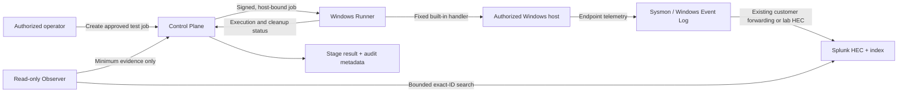

# Data Flow and Minimum Metadata v0.1

**Status:** Frozen for the technical PoC  
**Date:** August 5, 2026

## Purpose

Define the trust boundaries, fixed pipeline, and smallest evidence set required
to prove a detection-pipeline result without centralizing raw customer events.

## Data flow



## Trust boundaries

1. Operator identity and authorization at the Control Plane.
2. Signed job delivery from Control Plane to Runner.
3. Local privileged execution from Runner to the authorized host.
4. Existing endpoint telemetry transport into the customer SIEM.
5. Read-only, bounded Observer access to Splunk.
6. Evidence egress from customer environment to Control Plane.

## Fixed stage order

```text
execution
→ endpoint_telemetry
→ siem_ingestion
→ field_validation
→ detection
→ alert
→ cleanup
```

The order is immutable in schema version `1.0`. Cleanup is a terminal safety
stage and still runs after execution, observation, cancellation, or timeout
failures. A required upstream failure makes dependent stages `not_tested`.

## Minimum centrally stored metadata

### Run identity

- Schema version
- Run, job, environment, and opaque host IDs
- Canonical correlation ID
- Scenario ID and version
- Runner version

### Authorization evidence

- Signing key ID and signature-verification result
- Job issue and expiry timestamps
- Nonce-consumption result
- Maintenance-window and kill-switch decisions

### Stage evidence

- Stage name, status, required flag, start/completion timestamps, and latency
- Stable error code and bounded redacted summary
- Event count, Event ID, Record ID, index, and sourcetype when applicable
- Names of matched or missing required fields
- Hashes of approved artifacts or canonical evidence references
- Cleanup attempt count and verified-absence result

### Audit evidence

- Actor ID, action type, target opaque ID, timestamp, outcome, and request ID
- Previous-entry hash and entry hash when the audit hash chain is implemented

## Data excluded from central storage by default

- Raw SIEM or endpoint event bodies
- Command-line values
- Usernames or account identifiers from endpoint events
- Customer filenames, file content, registry values, or DNS response content
- Credentials, HEC tokens, API tokens, private keys, or session cookies
- Arbitrary environment variables or process output
- Security-product configuration exports

The Observer may inspect required values inside the customer boundary to decide
field presence. It returns field names and counts, not the values.

## Local PoC exception

The isolated founding lab stores ignored screenshots and JSON evidence under
`work/prooflayer-lab/evidence`. These files are not product telemetry, are not
committed, and must be removed or redacted before any public demonstration.

## Validation rules

- Evidence payloads reject unknown properties.
- Error messages are capped at 500 characters and must pass secret redaction.
- Correlation IDs are identifiers, never authorization credentials.
- A PASS cannot be produced from stage status alone; required evidence must be
  present and internally consistent.
- Customer deployments require an explicit retention ADR before storing run
  metadata beyond the active evaluation period.
