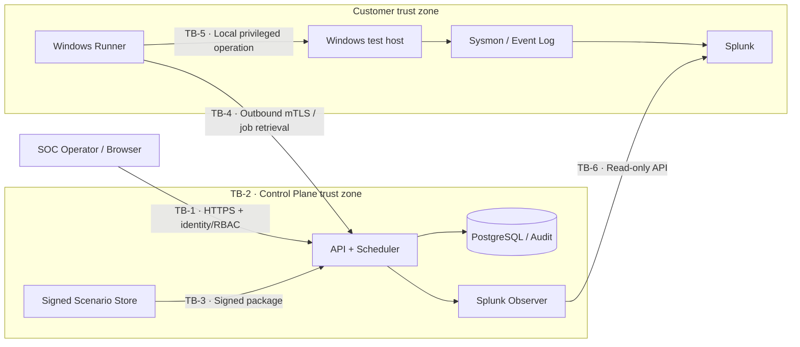

# ProofLayer threat model v0.1

**Date:** July 28, 2026  
**Scope:** Windows Runner → Control Plane → Splunk MVP  
**Method:** STRIDE and abuse-case review across data flows and trust boundaries  
**Status:** Design input; update after material architecture changes.

References:

- [OWASP Threat Modeling Cheat Sheet](https://cheatsheetseries.owasp.org/cheatsheets/Threat_Modeling_Cheat_Sheet.html)
- [OWASP Threat Modeling Project](https://owasp.org/www-project-threat-modeling/)
- [NIST Secure Software Development Framework](https://csrc.nist.gov/projects/ssdf)

## 1. Protected assets

| Asset | Why it matters |
|---|---|
| Scenario signing key | Prevents unauthorized packages from appearing trusted |
| Runner identity and certificate | Prevents host impersonation and unauthorized jobs |
| Splunk credential | Grants SIEM search access |
| Host scope and approval | Prevents tests on the wrong system |
| Scenario and allowlist integrity | Prevents the Runner becoming an attack tool |
| Test result and correlation ID | Establishes reliability of detection evidence |
| Audit log | Proves who ran what and when |
| Customer metadata | May reveal sensitive host and control information |
| Kill switch | Last-resort safe-stop control |

## 2. Actors

- Authorized SOC operator, administrator, and read-only viewer
- Windows Runner
- Control Plane, Scheduler, and Correlation Engine
- Splunk
- External attacker
- Compromised operator account
- Malicious or mistaken insider
- Supply-chain attacker

## 3. Data flow and trust boundaries

1. **TB-1 User → Control Plane:** identity, role, session, request integrity.
2. **TB-2 Application → data/secrets:** least privilege, encryption, audit
   integrity.
3. **TB-3 Scenario production → execution:** signature, version, allowlist,
   parameter schema.
4. **TB-4 Control Plane → Runner:** mutual identity, replay prevention, host
   scope.
5. **TB-5 Runner → Windows host:** local privilege, resource limits, cleanup.
6. **TB-6 Observer → Splunk:** minimum read-only permissions and query bounds.

## 4. Architecture assumptions

- The Runner operates in the customer environment and connects outbound.
- The MVP accepts only compiled or allowlisted scenario IDs and schema-validated
  parameters.
- The control plane cannot send arbitrary shell or PowerShell text.
- The Splunk credential has minimum search permissions.
- The test host is registered and explicitly authorized.
- The public demo never connects to a real Runner, control plane, or Splunk.
- `PASS` means the expected pipeline behavior was observed; it does not mean the
  environment is secure.

## 5. Prioritized threats

| ID | Threat / abuse case | STRIDE | Initial risk | Required control | Validation |
|---|---|---|---|---|---|
| TM-001 | Compromised control plane sends harmful commands | T/E | Critical | Runner allowlist, signed package, schema; no shell API | Unknown scenario and extra args rejected |
| TM-002 | Scenario package modified at rest or in transit | T | Critical | Offline signing root, manifest hash, signature/version checks | One-byte change prevents execution |
| TM-003 | Test runs on unauthorized host or tenant | S/E | Critical | Host registration, scope binding, RBAC, maintenance window | Foreign host ID rejected |
| TM-004 | Cleanup fails and leaves an artifact | T/DoS | High | Finally/defer cleanup, idempotence, evidence, recovery | Forced failure leaves no artifact |
| TM-005 | Runner certificate stolen or job replayed | S/R | High | Short-lived identity, nonce, expiry, one-time job ID, revocation | Same job cannot run twice |
| TM-006 | Splunk token leaks through logs or reports | I | High | Secret store, masking, minimum role, rotation | Token absent from logs and errors |
| TM-007 | Operator abuses a legitimate scenario for resource exhaustion | DoS/E | High | RBAC, rate limits, per-host concurrency one, resource limits, kill switch | Burst and long-running tests stop at limits |
| TM-008 | Result or audit data changed to create a false PASS | T/R | High | Append-only audit, stage evidence, result hash, separated privileges | Modification triggers integrity failure |
| TM-009 | Correlation collision or prediction links the wrong event | S/T | Medium | Cryptographic ID plus host/scenario/time binding | Collision and replay fixtures do not match |
| TM-010 | Raw SIEM content leaves the customer environment | I | High | Metadata allowlist, field redaction, raw event disabled | Schema rejects extra egress fields |
| TM-011 | Build or update chain compromised | T/E | Critical | Pinned dependencies, SBOM, signed artifacts, protected release | Unsigned artifact will not install |
| TM-012 | Runner or Observer overloads host or Splunk | DoS | High | Narrow windows, result limits, backoff, CPU/memory bounds | Load test remains under threshold |
| TM-013 | Viewer or operator performs admin action | E | High | Server-side RBAC; UI hiding is not a control | Negative role-matrix tests pass |
| TM-014 | Public demo reaches a real system | E/I | Critical | Separate deployment, fixed synthetic data, no credentials/connectors | Network and secret review finds no path |

## 6. MVP security requirements

### Runner

- Reject unknown scenario IDs and schema-invalid parameters.
- Require `job_id`, `host_id`, `scenario_version`, `expires_at`, nonce, and
  signature.
- Reject replayed jobs.
- Allow only one concurrent test with hard time and resource bounds.
- Record cleanup separately from the main result.
- Enforce the kill switch through local policy even without network access.

### Control Plane

- Enforce RBAC server-side on every sensitive endpoint.
- Audit test start, cancellation, package publication, and settings changes.
- Never store the scenario signing key in the application database.
- Never log secrets; error messages must not contain customer content.
- Revalidate host and tenant scope for every job.

### Observer and Splunk

- Grant the token only required index and search access.
- Bound query time range, result count, and runtime.
- Return field-presence and numeric metadata by default, not raw events.
- Bind correlation matches to host, scenario, and time window.

## 7. Open decisions

| Topic | Deadline | Secure default |
|---|---|---|
| Control Plane language | Resolved by ADR-0005 | Go standard library for the PoC |
| Scenario signature | Day 12 | Evaluate Ed25519 plus canonical manifest |
| Runner local privilege | Day 15 | Dedicated service account and minimum Windows privileges |
| Audit integrity | Day 31 | Append-only hash-chain PoC |
| Secret store | Day 53 | Deployment-appropriate managed or OS-backed store |

## 8. Pilot security gate

No customer pilot begins until TM-001, TM-002, TM-003, TM-004, TM-006, and
TM-014 have implemented controls and negative tests. Review this model at Days
30 and 60 and again before the first pilot.
